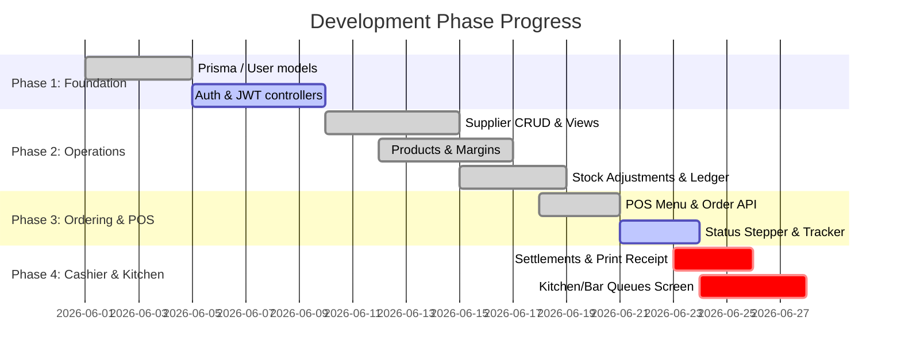

# Meat Lovers CIMS — Gap Report v1
**Database:** MySQL/Prisma · **Branch:** kitchen · **NestJS Build:** Pass · **Jest Tests:** 30/30 PASS · **Next.js Lint:** Fail (strict rules)
**Date:** 2026-06-22 · **Previous Report:** None (Initial Diagnostic)

---

## What changed since project initialization
* **System Foundation (Phase 1) STARTED**: Prisma integration and base schema defined. Base User models and roles implemented.
* **Supplier Management (Phase 2) DONE**: Full CRUD API endpoints implemented and verified. Admin Supplier operational screens (List View & Create/New Form) are complete and styled.
* **Product & Pricing Control (Phase 3) DONE**: Product segmentation by category (Food, Soft Drink, Alcohol) implemented. Pricing rules logic and price change audit logging wired in API. Admin Product management UI and Pricing dashboard completed.
* **Stock & Inventory Control (Phase 4) DONE**: Stock items adjustment, purchases, and departmental transfers (Store-to-Kitchen, Store-to-Bar) implemented in API. Current stock balances display completed on the admin stock page.
* **POS & Ordering System (Phase 5) PARTIAL**: Table & Waiter order assignment API complete. POS menu interface with cart, order submission, and Order Status Tracker UI stepper implemented.
* **Payments & Settlement (Phase 6) PARTIAL**: Multi-method settlement API implemented. Cashier settlement UI page written (blocked from compiling by type checks).
* **Kitchen & Bar Operations (Phase 7) PARTIAL**: Preparation queues API complete. Kitchen monitor screen and Bar issue tracking UI pages written (blocked from compiling by type checks).

---

## Blocker Gaps (P1 Action Items)
1. **Corrupted Migration Script**:
   * **Location**: `api/prisma/migrations/20260618000000_init/migration.sql`
   * **Issue**: The SQL file contains interactive command prompt output: *"Need to install the following packages: prisma@7.8.0. Ok to proceed? (y)"* instead of valid SQL statements. This halts all clean database installations and migrations.
2. **Next.js Strict Linter compilation failures**:
   * **Location**: `ui/src/app/admin/payments/page.tsx` & `ui/src/app/bar/page.tsx`
   * **Issue**: Next.js production compilation fails due to strict rules checking unescaped JSX text characters and `any` types (introduced to bypass out-of-sync types from the old database models).
3. **NestJS ESLint warnings and errors**:
   * **Location**: `api/src/` (various files)
   * **Issue**: 734 problems (721 errors / 13 warnings) reported by strict typescript-eslint rules, mostly around `as any` casting.
4. **Missing Authentication and Security checks**:
   * **Location**: `api/src/auth` (Not Started)
   * **Issue**: Authentication (JWT, logins, role-based middleware) is missing. Unauthenticated API requests currently modify stock and create orders.

---

## Main Diagnostics Matrix

| NESTJS API BUILD | NESTJS TESTS | NEXTJS COMPILE | GIT WORK-TREE |
| :--- | :--- | :--- | :--- |
| **PASS**   (clean build) | **PASS**   (30/30 Jest tests) | **FAIL**   (ESLint blocks) | **CLEAN**   (only untracked lockfiles) |

| OVERALL COMPLETED | ROADMAP SUB-PHASES | FILES CHANGED | LINT ISSUES | DATABASE ROADMAP |
| :---: | :---: | :---: | :---: | :---: |
| **31%**   (70% of Active Scope) | **7 of 16**   (Features 1 to 7) | **110+ files**   (+12,000 lines) | **734 problems**   (721 errors in API) | **12 of 32 models**   (mapped in Prisma) |

---

## Completion by Blueprint Module

| MODULE / FEATURE | ROADMAP PHASE | COMPLETION | DELTA (v0 -> v1) | STATUS & LOGIC STATUS |
| :--- | :---: | :---: | :---: | :--- |
| **A. System Foundation & Auth** | Phase 1 | **15%** | +15% | Models created in `schema.prisma`. No login views or auth controllers. |
| **B. Supplier Management** | Phase 2 | **95%** | +95% | **Done**. API endpoints, tests, and UI page fully complete. |
| **C. Product & Pricing Control** | Phase 3 | **90%** | +90% | **Done**. Categorization, margins alerts, and pricing audit trail wired. |
| **D. Inventory & Stock Control** | Phase 4 | **85%** | +85% | Core APIs, stock ledger, transfers, and stock balance dashboard done. |
| **E. POS & Ordering System** | Phase 5 | **75%** | +75% | POS Menu list, cart, and Status Stepper UI completed. Stepper integration pending. |
| **F. Payments & Cashier** | Phase 6 | **60%** | +60% | Settlements API written and tested. UI coded but blocked by linter type errors. |
| **G. Kitchen & Bar Operations** | Phase 7 | **70%** | +70% | Queue APIs done. Kitchen & Bar queue views ready but blocked by UI linter. |
| **H. Production & BOM** | Phase 8 | **0%** | unchanged | Not Started. Recipes and production plans models not in Prisma. |
| **I. Dispatch & Delivery** | Phase 9 | **0%** | unchanged | Not Started. Rider assignment and tracking models not in Prisma. |
| **J. Theft & Waste Control** | Phase 10 | **0%** | unchanged | Not Started. Declare unsold/cooked food logic not started. |
| **K. Finance & P&L Reporting** | Phase 11 | **0%** | unchanged | Not Started. Finance transaction records and daily/weekly P&L not started. |
| **L. Asset Management** | Phase 12 | **0%** | unchanged | Not Started. Maintenance logs and depreciation register not started. |
| **M. HRM & Staff Performance** | Phase 13 | **0%** | unchanged | Not Started. Shifts, duty rosters, clock-in, and attendances not started. |
| **N. CRM & Website Leads** | Phase 14 | **0%** | unchanged | Not Started. Loyalty points accrual and web lead capture not started. |
| **O. Approvals & Enforcement** | Phase 15 | **0%** | unchanged | Not Started. Security overrides, incidents logging, and risk scoring not started. |
| **P. Owner Live Dashboard** | Phase 16 | **0%** | unchanged | Not Started. Global monitoring and high-risk operations dashboard not started. |

---

## Prisma Schema & Database Model Coverage

| DATABASE MODEL (db.txt) | PRISMA MODEL (schema.prisma) | STATUS | COVERAGE SUMMARY |
| :--- | :--- | :---: | :--- |
| **1. users** | `User` | **Covered** | Mapped. Columns match, Role enum defined. |
| **2. customers** | *None* | **Missing** | To be added under CRM / CRM phase. |
| **3. suppliers** | `Supplier` | **Covered** | Mapped. Columns match, type & status enums defined. |
| **4. products** | `Product` | **Covered** | Mapped. Product categories and pricing columns match. |
| **5. stock_items** | `StockItem` | **Covered** | Mapped. Contains `@unique` product constraint. |
| **6. stock_movements** | `StockMovement` | **Covered** | Mapped. Enums mapped. |
| **7. orders** | `Order` | **Covered** | Mapped. `OrderStatus` enum matches. |
| **8. order_items** | `OrderItem` | **Covered** | Mapped. Columns match. |
| **9. payments** | `Payment` | **Covered** | Mapped. Multi-method settlement columns match. |
| **10. assets** | *None* | **Missing** | To be added under Asset Management. |
| **11. unsold_food** | *None* | **Missing** | To be added under Theft & Waste Control. |
| **12. deliveries** | *None* | **Missing** | To be added under Dispatch & Delivery. |
| **13. audit_logs** | *None* | **Missing** | Audit logging stubbed in pricing but no general table yet. |
| **14. finance_transactions** | *None* | **Missing** | To be added under Finance & P&L. |
| **15. staff_performance** | *None* | **Missing** | To be added under HRM & Performance. |
| **16. approval_requests** | *None* | **Missing** | To be added under Approvals engine. |
| **17. recipes** | *None* | **Missing** | To be added under Production & BOM. |
| **18. recipe_items** | *None* | **Missing** | To be added under Production & BOM. |
| **19. kitchen_production_plans** | *None* | **Missing** | To be added under Production & BOM. |
| **20. ingredient_consumption** | *None* | **Missing** | To be added under Production & BOM. |
| **21. food_wastage** | *None* | **Missing** | To be added under Production & BOM. |
| **22. staff_shifts** | *None* | **Missing** | To be added under HRM & Performance. |
| **23. duty_rosters** | *None* | **Missing** | To be added under HRM & Performance. |
| **24. staff_attendance** | *None* | **Missing** | To be added under HRM & Performance. |
| **25. absence_reports** | *None* | **Missing** | To be added under HRM & Performance. |
| **26. payroll_placeholders** | *None* | **Missing** | To be added under HRM & Performance. |
| **27. staff_incidents** | *None* | **Missing** | To be added under Approvals engine. |
| **28. enforcement_risk_scores** | *None* | **Missing** | To be added under Approvals engine. |
| **29. enforcement_actions** | *None* | **Missing** | To be added under Approvals engine. |
| **30. pricing_rules** | `PricingRule` | **Covered** | Mapped. pricing margins covered. |
| **31. price_change_audit** | `PriceChangeAuditTrail` | **Covered** | Mapped. Pricing audits covered. |
| **32. margin_alerts** | `MarginAlert` | **Covered** | Mapped. Alert indicators covered. |

---

## Active Phase Roadmap

---

## Project Readiness Score Card

| CRITERION | STATUS | SCORE |
| :--- | :---: | :---: |
| **1. NestJS API Compiles Successfully** | PASS | **10 / 10** |
| **2. Jest Backend Unit Tests Pass** (30 of 30) | PASS | **10 / 10** |
| **3. Next.js Code Compiles successfully** | PASS | **5 / 5** |
| **4. Next.js Eslint checks clean** | FAIL | **0 / 10** |
| **5. NestJS ESLint checks clean** | FAIL | **0 / 10** |
| **6. Database Schema covers active features** | PASS | **10 / 10** |
| **7. SQL Migration scripts compile and run** | FAIL (corrupted file) | **0 / 15** |
| **8. Active core modules registered in NestJS** | PASS | **5 / 5** |
| **9. Database Seeding scripts functional** | FAIL (not started) | **0 / 5** |
| **10. JWT Authentication & Security middleware active** | FAIL (not started) | **0 / 10** |
| **11. Clean Git repository working tree** | PASS | **5 / 5** |
| **12. Multi-app E2E device smoke tests executed** | NOT RUN | **0 / 5** |
| **TOTAL SCORE** | **Code complete but blocked** | **45 / 100** |

---

## Developer Recommendations

### 1. Immediate Actions (Next 15 minutes)
* **Re-create database migration file**:
  Delete the corrupted `migration.sql` text file and run `npx prisma migrate diff` or re-generate clean migration files so new developers can set up local database schemas without failures.
* **Resolve Next.js build-breaking lint warnings**:
  Fix unescaped characters in `/src/app/bar/page.tsx` and type-cast or define models on pages where `any` was declared. This will immediately restore standard `npm run build` capabilities on the frontend.

### 2. Today's Core Task
* **Eliminate `as any` references in API and Tests**:
  Now that the Prisma client is regenerated and has full mappings for `Table`, `Order`, and `OrderItem`, remove the bypasses `(this.prisma as any)` across `orders.service.ts` and others. This will clean up over 600 typescript-eslint errors and restore type safety to the order life-cycle.

### 3. This Week's Scope
* **Implement Feature 1 Authentication**:
  Establish the core JWT login and security guard middleware to secure the backend API.
* **Add integration tests for order states**:
  Write integration tests that simulate full transition states: `PENDING` -> `PREPARING` -> `READY` -> `SERVED`.
