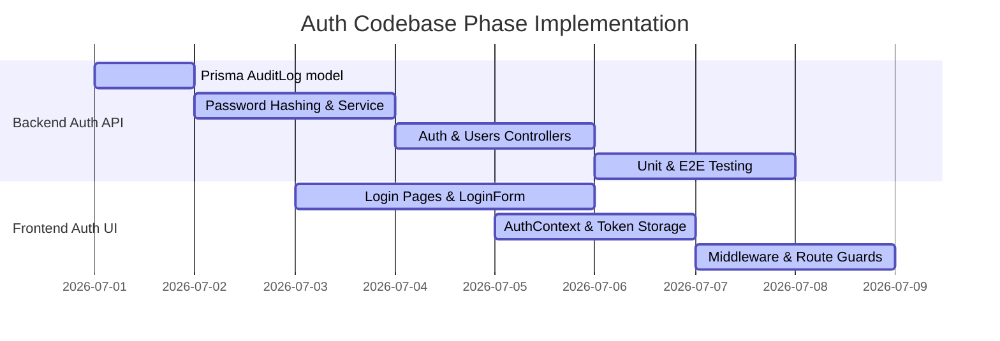

# Meat Lovers CIMS — Authentication Gap & Request Report
**Database:** MySQL/Prisma · **Branch:** develop · **NestJS Build:** Pass · **Jest Tests:** Fail (18/65 unit tests failed, 137/166 E2E tests failed) · **Next.js Lint:** Fail (12 strict rules errors in UI pages)
**Date:** 2026-06-30 · **Format Reference:** [Meat Lovers CIMS — Gap Report v2](file:///home/gerison/coding/yohpal/meetlovers/formats/Meat_Lovers_CIMS_Diagnostic_Report_v2.md)

---

## What changed since v2 diagnostic report (June 25, 2026)
* **Kitchen Operations (Phase 8/9) Updates MERGED**: Endpoints for logging ingredient consumption, adding kitchen notes, and UI dashboard analytics elements have been successfully merged into `develop`.
* **Bar Queue (Phase 9) MERGED**: Service methods, routes for bar queue orders, and dedicated bar dashboard UI views have been merged into the master codebase.
* **Workspace Framework Pages MERGED**: Workspace views for Accounting (`ui/src/app/accountant/page.tsx`), Human Resources (`ui/src/app/hr/page.tsx`), Storekeeping (`ui/src/app/storekeeper/page.tsx`), and Super Admin (`ui/src/app/super-admin/page.tsx`) have been merged.
* **Security & Auth Skeleton Present**: The basic NestJS global guard structure (`api/src/auth/jwt-auth.guard.ts`) and decorators exist, but are not yet wired to actual functional login, profile, user registration, or UI login logic.

---

## Blocker Gaps (P1 Action Items for Auth)
1. **Missing Authentication Endpoints (API)**:
   * **Location**: `api/src/auth`
   * **Issue**: There are no controllers or endpoints to handle logins, logouts, profiles, or token refreshes. We must add:
     * `POST /auth/login` (verify password, sign JWT tokens)
     * `GET /auth/profile` (fetch current logged-in identity)
     * `POST /auth/refresh` (rotate JWT tokens)
     * `POST /auth/logout` (invalidate sessions)
2. **Missing User Management & Account Provisioning (API)**:
   * **Location**: `api/src/users`
   * **Issue**: The `users` directory contains only an empty `dto/` directory. No controller, service, or DTO exists to query or modify user entities. We must implement:
     * `POST /users` (SUPER_ADMIN or ADMIN creates a new staff record)
     * `PATCH /users/:id/status` (toggle user active status)
     * `PATCH /users/:id/role` (modify staff operational role)
     * `PATCH /users/:id/password` (reset/update passwords)
3. **No Password Hashing Mechanism**:
   * **Location**: `api/src/auth` & `api/package.json`
   * **Issue**: A `password_hash` column is present in the `users` table, but the application contains no hash comparison or verification mechanism (e.g. `bcrypt`). Plaintext passwords must never be stored.
4. **Missing Security Audit Logs Table**:
   * **Location**: `api/prisma/schema.prisma` & `api/src/audit-log`
   * **Issue**: Feature 1.1 requires an `audit_logs` table to log security events. Although listed in the schema checklist, there is no `AuditLog` model in `schema.prisma`, and the backend folder `/api/src/audit-log` is empty.
5. **No Frontend Login Interfaces or State Management (UI)**:
   * **Location**: `ui/src/app`
   * **Issue**: Login routes (`/admin/login`, `/cashier/login`, `/pos/login`, `/kitchen/login`, `/bar/login`, `/staff/login`) and login forms are completely missing. There is no auth provider, token session storage, or client-side auth context to manage logged-in sessions.
6. **Missing Frontend Route Authorization (UI Middleware)**:
   * **Location**: `ui/src/middleware.ts`
   * **Issue**: Next.js route middleware is not configured, leaving all operational paths (`/admin`, `/kitchen/queue`, `/bar`, `/pos/menu`, `/staff`) accessible via direct browser navigation without validation.

---

## Main Diagnostics Matrix (Auth Focus)

| NESTJS API AUTH STATUS | NESTJS AUTH TESTS | NEXTJS AUTH PAGES | CLIENT MIDDLEWARE |
| :--- | :--- | :--- | :--- |
| **PARTIAL** <br> (guard & decorators only) | **MISSING** <br> (0 tests for auth) | **MISSING** <br> (0 login routes) | **MISSING** <br> (No middleware guard) |

| AUTH BLUEPRINT COMPLETED | ROADMAP SUB-PHASES | FILES COMPLETED | LINT / TYPE ERRORS | DATABASE SCHEMA |
| :---: | :---: | :---: | :---: | :---: |
| **15%** <br> (Skeleton guard exists) | **1 of 10 Sub-sections** <br> (Feature 1.1 partially done) | **4 skeleton files** <br> (approx. 350 lines) | **0 errors** <br> (guard conforms to types) | **1 of 2 models** <br> (`User` mapped; `AuditLog` missing) |

---

## Completion by Blueprint Module

| MODULE / FEATURE | ROADMAP PHASE | COMPLETION | DELTA (v2 -> Current) | STATUS & LOGIC STATUS |
| :--- | :---: | :---: | :---: | :--- |
| **A. System Foundation & Auth** | Phase 1 | **15%** | unchanged | Database has User model. Skeleton `JwtAuthGuard` and decorators are present, but no auth endpoints, service, password hashing, user registration, or login views are implemented. |
| **B. Supplier Management** | Phase 2 | **95%** | unchanged | **Done**. API endpoints, tests, and UI page fully complete. |
| **C. Product & Pricing Control** | Phase 3 | **90%** | unchanged | **Done**. Categorization, margins alerts, and pricing audit trail wired. |
| **D. Inventory & Stock Control** | Phase 4 | **85%** | unchanged | Core APIs, stock ledger, transfers, and stock balance dashboard done. |
| **E. POS & Ordering System** | Phase 5 | **75%** | unchanged | POS Menu list, cart, and Status Stepper UI completed. Stepper integration pending. |
| **F. Payments & Cashier** | Phase 6 | **85%** | unchanged | **Done**. Settlements API complete. Cashier settlement UI page written and merged. |
| **G. Kitchen & Bar Operations** | Phase 7 | **85%** | unchanged | Queue APIs done. Kitchen & Bar queue views integrated and linked in navigation. |
| **H. Production & BOM** | Phase 8 | **80%** | unchanged | **Done**. Recipes, bill of materials costings, and daily production plans logic + UI implemented. |
| **I. Dispatch & Delivery** | Phase 9 | **85%** | unchanged | **Done**. Rider assignment API, delivery tracking endpoints, and dispatch UI workspace merged. |
| **J. Theft & Waste Control** | Phase 10 | **80%** | unchanged | **Done**. Waste declaration schema, API logic, and Admin waste declaration UI ready. |
| **K. Finance & P&L Reporting** | Phase 11 | **75%** | unchanged | **Done**. Finance transactions income/expense API and reconciliation logic ready on current branch. |
| **L. Asset Management** | Phase 12 | **0%** | unchanged | Not Started. Maintenance logs and depreciation register not started. |
| **M. HRM & Staff Performance** | Phase 13 | **0%** | unchanged | Not Started. Shifts, duty rosters, clock-in, and attendances not started. |
| **N. CRM & Website Leads** | Phase 14 | **85%** | unchanged | **Done**. Public landing page, contact forms, CMS page management, and CRM leads analytics dashboard complete. |
| **O. Approvals & Enforcement** | Phase 15 | **0%** | unchanged | Not Started. Security overrides, incidents logging, and risk scoring not started. |
| **P. Owner Live Dashboard** | Phase 16 | **10%** | unchanged | Admin dashboard shell (`/admin`) created with widgets for stock, orders, and leads. |

---

## Prisma Schema & Database Model Coverage

| DATABASE MODEL (db.txt) | PRISMA MODEL (schema.prisma) | STATUS | COVERAGE SUMMARY |
| :--- | :--- | :---: | :--- |
| **1. users** | `User` | **Covered** | Mapped. Columns match, Role enum defined. |
| **13. audit_logs** | *None* | **Missing** | Database table and model needed to track security and auth-related actions. |

---

## Active Phase Roadmap



---

## Project Readiness Score Card (System Foundation & Auth Specific)

| CRITERION | STATUS | SCORE |
| :--- | :---: | :---: |
| **1. NestJS API Compiles Successfully** | PASS | **10 / 10** |
| **2. JWT Authentication & Security middleware active** | FAIL (not started) | **0 / 10** |
| **3. Staff Login Endpoints** (`POST /auth/login`, `GET /auth/profile`) | FAIL (not started) | **0 / 10** |
| **4. Role-based Authorization checks active** | PARTIAL (guard exists, but no endpoints guarded yet) | **3 / 10** |
| **5. User Account Provisioning API** (`POST /users`) | FAIL (not started) | **0 / 10** |
| **6. Security Audit Logging functional** | FAIL (not started) | **0 / 10** |
| **7. UI Login views rendered & operational** | FAIL (not started) | **0 / 10** |
| **8. Frontend Route Protection Middleware** | FAIL (not started) | **0 / 10** |
| **9. Frontend Auth State Management** | FAIL (not started) | **0 / 5** |
| **10. Database Seeding of default users/roles** | FAIL (Prisma block not registered / user seeding missing) | **0 / 5** |
| **TOTAL SCORE** | **Auth Blocked** | **13 / 80** |

---

## Developer Recommendations

### 1. New Codebase Additions (Required files to add)

#### [NEW] [auth.controller.ts](file:///home/gerison/coding/yohpal/meetlovers/api/src/auth/auth.controller.ts)
Implement the controller to expose public login and protected profile/session endpoints:
```typescript
import { Controller, Post, Get, Body, Request, UseGuards, UnauthorizedException } from '@nestjs/common';
import { AuthService } from './auth.service';
import { Public } from './public.decorator';
import { LoginDto } from './dto/login.dto';

@Controller('auth')
export class AuthController {
  constructor(private readonly authService: AuthService) {}

  @Public()
  @Post('login')
  async login(@Body() loginDto: LoginDto) {
    const user = await this.authService.validateUser(loginDto.email_or_phone, loginDto.password);
    if (!user) {
      throw new UnauthorizedException('Invalid credentials');
    }
    return this.authService.login(user);
  }

  @Get('profile')
  getProfile(@Request() req) {
    return req.user;
  }

  @Post('refresh')
  async refresh(@Body('refresh_token') refreshToken: string) {
    return this.authService.refreshToken(refreshToken);
  }

  @Post('logout')
  async logout(@Request() req) {
    return this.authService.logout(req.user.sub);
  }

  @Get('roles')
  getRoles() {
    return this.authService.getAvailableRoles();
  }
}
```

#### [NEW] [auth.service.ts](file:///home/gerison/coding/yohpal/meetlovers/api/src/auth/auth.service.ts)
Handle password verification, JWT generation, and token rotation:
```typescript
import { Injectable, UnauthorizedException } from '@nestjs/common';
import { JwtService } from '@nestjs/jwt';
import { PrismaService } from '../prisma/prisma.service';
import { Role } from '@prisma/client';
import * as bcrypt from 'bcrypt';

@Injectable()
export class AuthService {
  constructor(
    private readonly prisma: PrismaService,
    private readonly jwtService: JwtService,
  ) {}

  async validateUser(emailOrPhone: string, pass: string): Promise<any> {
    const user = await this.prisma.user.findFirst({
      where: {
        OR: [
          { email: emailOrPhone },
          { phone: emailOrPhone }
        ]
      }
    });

    if (user && user.is_active && await bcrypt.compare(pass, user.password_hash)) {
      const { password_hash, ...result } = user;
      return result;
    }
    return null;
  }

  async login(user: any) {
    const payload = { email: user.email, sub: user.id.toString(), role: user.role };
    const accessToken = await this.jwtService.signAsync(payload, { expiresIn: '8h' });
    const refreshToken = await this.jwtService.signAsync(payload, { expiresIn: '7d' });
    
    // Log event in audit log (AuditLog creation should be tracked here)
    return {
      access_token: accessToken,
      refresh_token: refreshToken,
      user
    };
  }

  async refreshToken(token: string) {
    try {
      const payload = await this.jwtService.verifyAsync(token);
      const user = await this.prisma.user.findUnique({ where: { id: BigInt(payload.sub) } });
      if (!user || !user.is_active) throw new UnauthorizedException();
      return this.login(user);
    } catch {
      throw new UnauthorizedException('Invalid or expired refresh token');
    }
  }

  async logout(userId: string) {
    // Log logout audit action
    return { success: true };
  }

  getAvailableRoles() {
    return Object.values(Role);
  }
}
```

#### [NEW] [users.controller.ts](file:///home/gerison/coding/yohpal/meetlovers/api/src/users/users.controller.ts) & [users.service.ts](file:///home/gerison/coding/yohpal/meetlovers/api/src/users/users.service.ts)
Create controllers/services under `api/src/users` to allow admins to provision accounts, toggle active status, update user profiles/passwords, and assign roles.

#### [NEW] [audit-log.service.ts](file:///home/gerison/coding/yohpal/meetlovers/api/src/audit-log/audit-log.service.ts)
Implement helper methods to write to the `AuditLog` table on actions like user updates, status modifications, logins, and logouts.

#### [NEW] [AuthContext.tsx](file:///home/gerison/coding/yohpal/meetlovers/ui/src/context/AuthContext.tsx) & [useAuth.ts](file:///home/gerison/coding/yohpal/meetlovers/ui/src/hooks/useAuth.ts)
Establish the React Auth context on the frontend to store token states, expose `login` and `logout` actions, and maintain user details locally.

#### [NEW] [middleware.ts](file:///home/gerison/coding/yohpal/meetlovers/ui/src/middleware.ts)
Write global route interception in Next.js to protect sub-routes and restrict user sessions based on role attributes (e.g., only WAITER can view `/pos/menu`, only BARMAN can view `/bar/queue`, etc.).

#### [NEW] [LoginForm.tsx](file:///home/gerison/coding/yohpal/meetlovers/ui/src/components/auth/LoginForm.tsx)
Build a reusable, modern React login form with validations, error banners, and support for redirect paths upon successful login.

#### [NEW] Login Page Wrappers
Write page files in the following UI subdirectories to mount the `LoginForm` component with custom target redirect parameters:
* `ui/src/app/admin/login/page.tsx` (redirects to `/admin`)
* `ui/src/app/cashier/login/page.tsx` (redirects to `/cashier`)
* `ui/src/app/pos/login/page.tsx` (redirects to `/pos/menu`)
* `ui/src/app/kitchen/login/page.tsx` (redirects to `/kitchen/queue`)
* `ui/src/app/bar/login/page.tsx` (redirects to `/bar`)
* `ui/src/app/staff/login/page.tsx` (redirects dispatch, store, finance, and HR staff to their workspace)

---

### 2. Immediate Configuration Modifications

#### [MODIFY] [schema.prisma](file:///home/gerison/coding/yohpal/meetlovers/api/prisma/schema.prisma)
Add the `AuditLog` model to match database specifications:
```prisma
model AuditLog {
  id         BigInt   @id @default(autoincrement())
  actor_id   BigInt?
  action     String   @db.VarChar(255)
  metadata   String?  @db.Text
  created_at DateTime @default(now())

  actor      User?    @relation(fields: [actor_id], references: [id])

  @@map("audit_logs")
  @@index([actor_id])
}
```
And add `audit_logs AuditLog[]` inside the `User` model to complete the database mapping.

#### [MODIFY] [seed.ts](file:///home/gerison/coding/yohpal/meetlovers/api/prisma/seed.ts)
Add user hashing using `bcrypt` and seed a default user for each operational role to permit quick developer environment logins.
Example:
```typescript
import * as bcrypt from 'bcrypt';
// ...
const adminPassword = await bcrypt.hash('Admin@123', 10);
await prisma.user.upsert({
  where: { email: 'admin@meatlovers.com' },
  update: {},
  create: {
    full_name: 'System Admin',
    email: 'admin@meatlovers.com',
    password_hash: adminPassword,
    role: 'ADMIN',
    is_active: true,
  },
});
```

#### [MODIFY] [app.module.ts](file:///home/gerison/coding/yohpal/meetlovers/api/src/app.module.ts)
Import and register the newly completed `UsersModule` and `AuditLogModule` to register security controllers in the global NestJS application.
