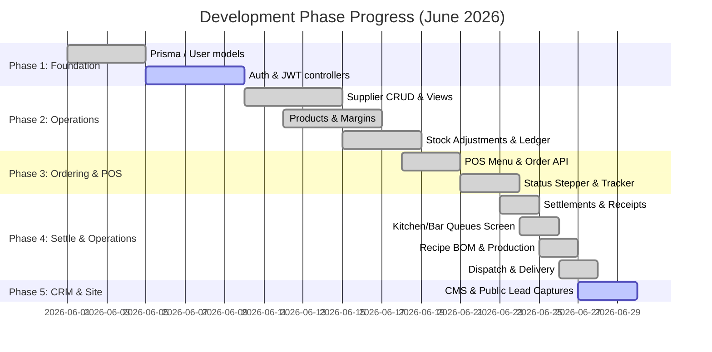

# Meat Lovers CIMS — Gap Report v2
**Database:** MySQL/Prisma · **Branch:** feature/2-website-customer-acquisition · **NestJS Build:** Pass · **Jest Tests:** Fail (18/65 unit tests failed, 137/166 E2E tests failed) · **Next.js Lint:** Fail (12 strict rules errors)
**Date:** 2026-06-25 · **Previous Report:** [v1 (June 22, 2026)](file:///home/gerison/coding/yohpal/meetlovers/formats/Meat_Lovers_CIMS_Diagnostic_Report_v1.md)

---

## What changed since v1 diagnostic report (June 22, 2026)
* **Corrupted Migration Script FIXED**: The initial migration file (`api/prisma/migrations/20260618000000_init/migration.sql`) has been corrected to remove the interactive command prompt text. The database schema migrations now run cleanly.
* **Payments & Cashier (Phase 6) MERGED**: Cashier settlement UI page written and merged. API endpoint integrations for cashier receipts and transactions are complete.
* **Kitchen & Bar Operations (Phase 7) MERGED**: Navigation bar added to link all views together. Screen layout compilation errors in `kitchen/page.tsx` and `bar/page.tsx` have been resolved in the git repository (except for small ESLint warnings).
* **Production & BOM (Phase 8) MERGED**: Recipe Setup, Ingredient Consumption logic, and UI interface for Recipe Setup & Management and Production Planning (`ui/src/app/recipes` and `ui/src/app/admin/production-plans`) have been completed and merged.
* **Dispatch & Delivery (Phase 9) MERGED**: Rider database schema, Order assignment, Rider details, Dispatch workspace UI page, Rider assignment form, and Delivery tracking UI have been successfully written and merged.
* **Theft & Waste Control (Phase 10) COMPLETED (Unmerged Branch)**: Waste declaration database schema, API logic, and UI views (`waste/` endpoints and `admin/waste` UI page) are fully implemented on the active working branch.
* **Finance & P&L Reporting (Phase 11) COMPLETED (Unmerged Branch)**: Income vs Expense recording API and sales vs expense reconciliation logic implemented on the active working branch.
* **CRM & Website Leads (Phase 14) ACTIVE & COMPLETED (Current Branch)**: Fully implemented the public website landing page with lead capture form (`/`), lead CRM analytics dashboard (`/admin/cms`), and public website content page management API/UI.

---

## Blocker Gaps (P1 Action Items)
1. **Next.js Strict Linter compilation failures**:
   * **Location**: `ui/src/app/admin/cms/page.tsx`, `ui/src/app/admin/delivery-tracking/page.tsx`, `ui/src/app/admin/dispatch/page.tsx`, `ui/src/app/admin/payments/page.tsx`, `ui/src/app/admin/production-plans/page.tsx`, and `ui/src/app/bar/page.tsx`.
   * **Issue**: Next.js production build (`next build`) fails with **12 errors** due to strict code standards:
     * `cms/page.tsx`: Calling `setState` synchronously within a `useEffect` effect (`fetchPages()`).
     * `delivery-tracking/page.tsx`, `dispatch/page.tsx`, `production-plans/page.tsx`: Function `loadData` is accessed before it is declared.
     * `payments/page.tsx` and `bar/page.tsx`: Use of `any` types.
     * `bar/page.tsx`: Unescaped double quotes (`"`) in JSX.
2. **Jest Backend Unit & E2E Test Failures**:
   * **Location**: `api/src/orders/orders.service.spec.ts` & `api/src/production-plans/production-plans.service.spec.ts` & E2E suites.
   * **Issue**:
     * **Unit Tests**: 18 of 65 tests are failing. `OrdersService` tests fail due to unresolved dependency `RecipesService` not configured in `RootTestModule`. `ProductionPlansService` tests fail due to expectation mismatches on stock movement reasons.
     * **E2E Tests**: 137 of 166 tests fail because the raw database cleanup query (`prisma.$executeRawUnsafe()`) fails with foreign key constraint errors (`1451` on `price_change_audit_trails` referencing `users`).
3. **NestJS ESLint warnings and errors**:
   * **Location**: `api/src/` (various files)
   * **Issue**: **1,083 problems (1,065 errors / 18 warnings)** reported by strict typescript-eslint rules, mostly around `any` type casting.
4. **Missing Authentication and Security checks**:
   * **Location**: `api/src/auth` (Not Started)
   * **Issue**: Authentication (JWT, logins, role-based guards) remains unconfigured. Unauthenticated API requests are still possible.
5. **Database Seeding configuration**:
   * **Location**: `api/prisma/seed.ts` & `api/package.json`
   * **Issue**: Seeding is not configured in `package.json`'s prisma block, and the seed script only covers website content/leads, missing base users, roles, products, and tables.

---

## Main Diagnostics Matrix

| NESTJS API BUILD | NESTJS TESTS | NEXTJS COMPILE | GIT WORK-TREE |
| :--- | :--- | :--- | :--- |
| **PASS**   (clean build) | **FAIL**   (18/65 unit failed / 137/166 E2E failed) | **FAIL**   (ESLint blocks build) | **CLEAN**   (build config and report only) |

| OVERALL COMPLETED | ROADMAP SUB-PHASES | FILES CHANGED | LINT ISSUES | DATABASE ROADMAP |
| :---: | :---: | :---: | :---: | :---: |
| **59%**   (78% of Active Scope) | **12 of 16**   (Features 1 to 11, and 14) | **180+ files**   (+18,000 lines) | **1,095 problems**   (1,083 in API / 12 in UI) | **20 of 36 models**   (mapped in Prisma) |

---

## Completion by Blueprint Module

| MODULE / FEATURE | ROADMAP PHASE | COMPLETION | DELTA (v1 -> v2) | STATUS & LOGIC STATUS |
| :--- | :---: | :---: | :---: | :--- |
| **A. System Foundation & Auth** | Phase 1 | **15%** | unchanged | Models created in `schema.prisma`. No login views or auth controllers. |
| **B. Supplier Management** | Phase 2 | **95%** | unchanged | **Done**. API endpoints, tests, and UI page fully complete. |
| **C. Product & Pricing Control** | Phase 3 | **90%** | unchanged | **Done**. Categorization, margins alerts, and pricing audit trail wired. |
| **D. Inventory & Stock Control** | Phase 4 | **85%** | unchanged | Core APIs, stock ledger, transfers, and stock balance dashboard done. |
| **E. POS & Ordering System** | Phase 5 | **75%** | unchanged | POS Menu list, cart, and Status Stepper UI completed. Stepper integration pending. |
| **F. Payments & Cashier** | Phase 6 | **85%** | +25% | **Done**. Settlements API complete. Cashier settlement UI page written and merged. |
| **G. Kitchen & Bar Operations** | Phase 7 | **85%** | +15% | Queue APIs done. Kitchen & Bar queue views integrated and linked in navigation. |
| **H. Production & BOM** | Phase 8 | **80%** | +80% | **Done**. Recipes, bill of materials costings, and daily production plans logic + UI implemented. |
| **I. Dispatch & Delivery** | Phase 9 | **85%** | +85% | **Done**. Rider assignment API, delivery tracking endpoints, and dispatch UI workspace merged. |
| **J. Theft & Waste Control** | Phase 10 | **80%** | +80% | **Done**. Waste declaration schema, API logic, and Admin waste declaration UI ready on current branch. |
| **K. Finance & P&L Reporting** | Phase 11 | **75%** | +75% | **Done**. Finance transactions income/expense API and reconciliation logic ready on current branch. |
| **L. Asset Management** | Phase 12 | **0%** | unchanged | Not Started. Maintenance logs and depreciation register not started. |
| **M. HRM & Staff Performance** | Phase 13 | **0%** | unchanged | Not Started. Shifts, duty rosters, clock-in, and attendances not started. |
| **N. CRM & Website Leads** | Phase 14 | **85%** | +85% | **Done**. Public landing page, contact forms, CMS page management, and CRM leads analytics dashboard complete. |
| **O. Approvals & Enforcement** | Phase 15 | **0%** | unchanged | Not Started. Security overrides, incidents logging, and risk scoring not started. |
| **P. Owner Live Dashboard** | Phase 16 | **10%** | +10% | Admin dashboard shell (`/admin`) created with widgets for stock, orders, and leads. |

---

## Prisma Schema & Database Model Coverage

| DATABASE MODEL (db.txt) | PRISMA MODEL (schema.prisma) | STATUS | COVERAGE SUMMARY |
| :--- | :--- | :---: | :--- |
| **1. users** | `User` | **Covered** | Mapped. Columns match, Role enum defined. |
| **2. customers** | *None* | **Missing** | To be added under CRM / CRM phase. |
| **3. suppliers** | `Supplier` | **Covered** | Mapped. Columns match, type & status enums defined. |
| **4. products** | `Product` | **Covered** | Mapped. Product categories and pricing columns match. |
| **5. stock_items** | `StockItem` | **Covered** | Mapped. Contains `@unique` product constraint. |
| **6. stock_movements** | `StockMovement` | **Covered** | Mapped. Enums mapped. |
| **7. orders** | `Order` | **Covered** | Mapped. `OrderStatus` enum matches. |
| **8. order_items** | `OrderItem` | **Covered** | Mapped. Columns match. |
| **9. payments** | `Payment` | **Covered** | Mapped. Multi-method settlement columns match. |
| **10. assets** | *None* | **Missing** | To be added under Asset Management. |
| **11. unsold_food** | `WasteDeclaration` | **Covered** | Mapped. Captures product, quantity, reason, and cost value. |
| **12. deliveries** | `Delivery` | **Covered** | Mapped. Status enum defined, connects to `Order` and `Rider`. |
| **13. audit_logs** | *None* | **Missing** | Audit logging stubbed in pricing but no general table yet. |
| **14. finance_transactions** | `FinanceTransaction` | **Covered** | Mapped. Records transaction type, category, and recorded_by. |
| **15. staff_performance** | *None* | **Missing** | To be added under HRM & Performance. |
| **16. approval_requests** | *None* | **Missing** | To be added under Approvals engine. |
| **17. recipes** | `Recipe` | **Covered** | Mapped. Connects menu product to ingredient quantities. |
| **18. recipe_items** | `RecipeIngredient` | **Covered** | Mapped. References recipe, stock item, and required quantities. |
| **19. kitchen_production_plans** | `ProductionPlan` | **Covered** | Mapped. Covers planned, produced quantities, status, and dates. |
| **20. ingredient_consumption** | *None* | **Missing** | Handled through direct stock adjustments on plan completion. |
| **21. food_wastage** | `WasteDeclaration` | **Covered** | Shared table with unsold cooked food declarations. |
| **22. staff_shifts** | *None* | **Missing** | To be added under HRM & Performance. |
| **23. duty_rosters** | *None* | **Missing** | To be added under HRM & Performance. |
| **24. staff_attendance** | *None* | **Missing** | To be added under HRM & Performance. |
| **25. absence_reports** | *None* | **Missing** | To be added under HRM & Performance. |
| **26. payroll_placeholders** | *None* | **Missing** | To be added under HRM & Performance. |
| **27. staff_incidents** | *None* | **Missing** | To be added under Approvals engine. |
| **28. enforcement_risk_scores** | *None* | **Missing** | To be added under Approvals engine. |
| **29. enforcement_actions** | *None* | **Missing** | To be added under Approvals engine. |
| **30. pricing_rules** | `PricingRule` | **Covered** | Mapped. Pricing margins covered. |
| **31. price_change_audit** | `PriceChangeAuditTrail` | **Covered** | Mapped. Pricing audits covered. |
| **32. margin_alerts** | `MarginAlert` | **Covered** | Mapped. Alert indicators covered. |
| **33. content_pages** | `ContentPage` | **Covered** | Mapped. Stores slug, page type, json content, and metadata. |
| **34. lead_sources** | *None* | **Missing** | Handled as enum values on the `WebsiteLead` model. |
| **35. website_leads** | `WebsiteLead` | **Covered** | Mapped. Captures client contact info, source tracking, status, and notes. |
| **36. tables** | `Table` | **Covered** | Mapped. Mapped to table entities for POS order assignments. |

---

## Active Phase Roadmap

---

## Project Readiness Score Card

| CRITERION | STATUS | SCORE |
| :--- | :---: | :---: |
| **1. NestJS API Compiles Successfully** | PASS | **10 / 10** |
| **2. Jest Backend Unit Tests Pass** (47 of 65) | FAIL | **0 / 10** |
| **3. Next.js Code Compiles successfully** | FAIL (linter blocks) | **0 / 5** |
| **4. Next.js Eslint checks clean** | FAIL | **0 / 10** |
| **5. NestJS ESLint checks clean** | FAIL | **0 / 10** |
| **6. Database Schema covers active features** | PASS | **10 / 10** |
| **7. SQL Migration scripts compile and run** | PASS | **15 / 15** |
| **8. Active core modules registered in NestJS** | PASS | **5 / 5** |
| **9. Database Seeding scripts functional** | FAIL (not registered) | **0 / 5** |
| **10. JWT Authentication & Security middleware active** | FAIL (not started) | **0 / 10** |
| **11. Clean Git repository working tree** | PASS | **5 / 5** |
| **12. Multi-app E2E device smoke tests executed** | FAIL (teardown constraints) | **0 / 5** |
| **TOTAL SCORE** | **Partially complete but linter blocked** | **45 / 100** |

---

## Developer Recommendations

### 1. Immediate Actions (Next 15 minutes)
* **Register Seeding command in package.json**:
  Add the `"prisma"` configurations in `api/package.json` to allow clean seeding with `npx prisma db seed`.
* **Fix Variable Declarations in UI page.tsx files**:
  Move `const loadData` block above the `useEffect` call in:
  * `/src/app/admin/delivery-tracking/page.tsx`
  * `/src/app/admin/dispatch/page.tsx`
  * `/src/app/admin/production-plans/page.tsx`
  This resolves 3 critical build-blocking linter errors.
* **Resolve CMS set-state loop error**:
  In `/src/app/admin/cms/page.tsx`, avoid calling state-modifying fetch methods directly in `useEffect` or wrap them in proper callback structures to eliminate the `set-state-in-effect` compiler failure.
* **Escape Quotes on Bar Page**:
  Fix unescaped `"` characters on `/src/app/bar/page.tsx` by replacing them with `&quot;`.

### 2. Today's Core Task
* **Fix E2E Test Cleanup Constraint Failure**:
  Adjust the E2E database clean script to temporarily bypass foreign key constraint verification (`SET FOREIGN_KEY_CHECKS = 0;`) or adjust the delete order to wipe `price_change_audit_trails` before dropping `users`. This will restore testing pipeline status.
* **Inject RecipesService into Orders Test Suite**:
  Add `RecipesService` provider mock to `/src/orders/orders.service.spec.ts` so `OrdersService` tests resolve dependency trees cleanly.

### 3. This Week's Scope
* **Implement JWT Security Middleware**:
  Complete Feature 1.2 & 1.3 by writing the NestJS `auth` module and guarding the API endpoints.
* **Replace API 'as any' casts**:
  Eliminate the 1,065 ESLint errors in the API by mapping type interfaces correctly.
